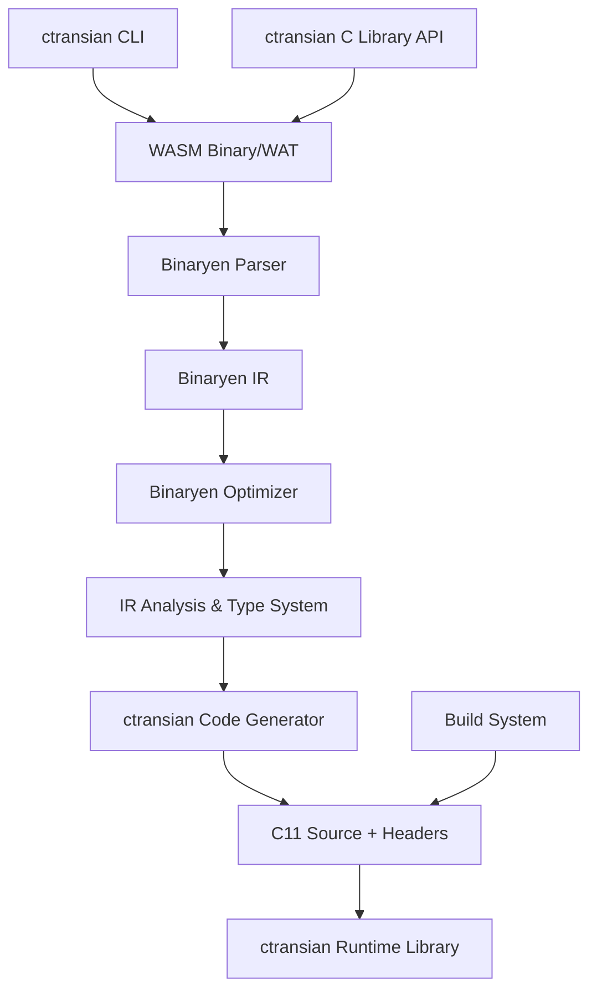

# ctransian Project Plan

## Project Overview

**Project Name:** `ctransian` (C + translation + "-ian" suffix suggesting "one who translates")

**Mission:** To create the most advanced WebAssembly to C translator by leveraging Binaryen's optimization capabilities while providing comprehensive modern C support.

## Technical Architecture

### Translation Pipeline



### Core Components

1. **Translation Engine** (`src/core/`)
   - `translator.h/cpp`: Main translation orchestrator
   - `type_mapper.h/cpp`: WASM types to C types mapping
   - `instruction_visitor.h/cpp`: Visitor pattern for WASM instructions
   - `code_generator.h/cpp`: C code generation utilities

2. **CLI Interface** (`src/cli/`)
   - Command-line argument parsing
   - File I/O handling
   - Configuration management

3. **Public API** (`src/api/`)
   - C API headers and implementation
   - Context management
   - Configuration structures

4. **Runtime Library** (`src/runtime/`)
   - Memory management
   - Thread support
   - Exception handling
   - Import/Export bridges

## Feature Support Matrix

| Category | Features | Status | Notes |
|----------|----------|--------|-------|
| **Core WASM** | i32, i64, f32, f64, control flow | ✅ Planned | Full MVP support |
| **SIMD** | v128 operations, vector intrinsics | ✅ Planned | GCC/Clang intrinsics |
| **Threading** | Shared memory, atomic operations | ✅ Planned | C11 threads |
| **Memory** | Multi-memory, bulk operations | ✅ Planned | Bounds checking |
| **GC Types** | struct, array, string references | 🔄 Future | WasmGC proposal |
| **WASI** | System interface | 🔄 Future | Full WASI support |
| **Exception** | try/catch, throw | 🔄 Future | setjmp/longjmp |

## Implementation Phases

### Phase 1: Foundation (Weeks 1-2)
- [x] Project structure and build system
- [x] Basic CMake configuration
- [x] Core headers and API design
- [ ] Binaryen integration setup
- [ ] Basic WASM parsing framework

### Phase 2: Core Translation (Weeks 3-4)
- [ ] Type system implementation
- [ ] Basic instruction translation
- [ ] Memory model implementation
- [ ] Function calling conventions

### Phase 3: Advanced Features (Weeks 5-6)
- [ ] SIMD instruction support
- [ ] Threading implementation
- [ ] Exception handling
- [ ] Reference types foundation

### Phase 4: Optimization & Polish (Weeks 7-8)
- [ ] Binaryen optimization integration
- [ ] Performance tuning
- [ ] Comprehensive testing
- [ ] Documentation completion

## Technical Specifications

### CLI Tool Design

```bash
ctransian [OPTIONS] INPUT.wasm -o OUTPUT.c

Options:
  --optimize-level[=0-3]     Binaryen optimization level (default: 2)
  --enable-simd             Enable SIMD translation with intrinsics
  --enable-threads          Enable C11 threading support
  --enable-gc               Enable WebAssembly GC types
  --bounds-check[=mode]     Bounds checking: strict, relaxed, none
  --runtime=embedded|standalone  Runtime implementation choice
  --target-c=c99|c11|gnu11   C language standard
  --debug                   Generate debug information
  --validate               Validate input before translation
  --wasi                   Enable WASI system interface
  --experimental           Enable experimental WASM proposals
```

### C Library API

```c
typedef struct ctransian_config {
    int optimization_level;
    bool enable_simd;
    bool enable_threads;
    bool enable_gc;
    bool bounds_checking;
    bool wasi_support;
    const char* target_c_standard;
} ctransian_config_t;

typedef struct ctransian_context ctransian_context_t;

ctransian_context_t* ctransian_create(const ctransian_config_t* config);

int ctransian_translate_binary(ctransian_context_t* ctx, 
                               const uint8_t* wasm_data, 
                               size_t wasm_size,
                               char** source, char** header);

void ctransian_destroy_context(ctransian_context_t* ctx);
```

## Performance Targets

### Translation Performance
- **Small modules** (<1MB): <100ms translation time
- **Medium modules** (1-10MB): <1s translation time
- **Large modules** (>10MB): <5s translation time

### Runtime Performance
- **Execution speed**: 2-5x faster than WebAssembly interpreters
- **Memory usage**: Within 20% of native C implementation
- **Code size**: 80-90% size of hand-written C equivalent

### Optimization Features
- **Dead code elimination**: Automatic removal of unused code
- **Constant folding**: Compile-time evaluation of constants
- **Loop optimization**: Recognition and optimization of common patterns
- **Inlined operations**: Direct C equivalents for simple WASM instructions

## Testing Strategy

### Unit Tests
- Individual instruction translation accuracy
- Type mapping correctness
- Error handling and edge cases

### Integration Tests
- Complete module translation
- Runtime behavior verification
- Cross-platform compatibility

### Performance Tests
- Benchmark suites vs existing tools
- Memory usage profiling
- Translation speed measurement

### Conformance Tests
- WebAssembly official test suite
- WABT compatibility tests
- Real-world application validation

## Build System Configuration

### CMake Features
```cmake
project(ctransian VERSION 1.0.0 LANGUAGES C CXX)

# Core requirements
find_package(PkgConfig REQUIRED)
pkg_check_modules(BINARYEN REQUIRED binaryen)

# Optional features
option(CTRANIAN_ENABLE_WASI "Enable WASI support" ON)
option(CTRANIAN_ENABLE_GC "Enable WasmGC support" OFF)
option(CTRANIAN_BUILD_TESTS "Build tests" ON)
option(CTRANIAN_BUILD_EXAMPLES "Build examples" ON)

# Build targets
add_executable(ctransian src/cli/main.cpp)
add_library(ctransian-static STATIC ${CORE_SOURCES})
add_library(ctransian-shared SHARED ${CORE_SOURCES})
```

## Documentation Plan

### User Documentation
1. **Getting Started**: Installation and basic usage
2. **API Reference**: Complete C API documentation
3. **Performance Guide**: Optimization tips and best practices
4. **Migration Guide**: Moving from existing tools
5. **Feature Matrix**: Detailed feature support information

### Developer Documentation
1. **Architecture Overview**: System design and components
2. **Contributing Guide**: Development setup and guidelines
3. **Code Style**: Formatting and conventions
4. **Testing Guide**: Running and writing tests

## Success Metrics

### Technical Goals
- 100% WebAssembly MVP compliance by Phase 2
- Support for 80% of active WASM proposals by Phase 4
- 2-5x performance improvement over interpreters
- 80%+ reduction in code size vs naive translation
- Sub-second translation time for typical modules

### Adoption Goals
- Easy migration path from existing tools
- Integration with major build systems
- Community contribution guidelines
- Performance comparison published

## Competitive Advantages

1. **Binaryen Integration**: Superior optimization pipeline
2. **Modern C Support**: C11 with threading and atomics
3. **Comprehensive Features**: Support for most WASM proposals
4. **Performance Focus**: Optimized for speed and size
5. **Developer Experience**: Clean API and extensive documentation

## Risk Mitigation

### Technical Risks
- **Binaryen Dependency**: Version compatibility management
- **Feature Complexity**: Phased implementation approach
- **Performance Targets**: Continuous benchmarking and optimization

### Project Risks
- **Timeline Management**: Regular milestone reviews
- **Resource Allocation**: Core vs advanced feature prioritization
- **Community Adoption**: Early engagement and feedback collection

## Future Roadmap

### Short Term (3-6 months)
- Complete core implementation
- Establish community presence
- Performance benchmarking

### Medium Term (6-12 months)
- Advanced WASM proposal support
- Integration with major build systems
- Production deployments

### Long Term (1-2 years)
- WasmGC full implementation
- Advanced optimization passes
- Plugin architecture for extensions

---

This plan provides a comprehensive foundation for building `ctransian` as a leading WebAssembly to C translator, leveraging Binaryen's strengths while addressing the gaps in existing tools.